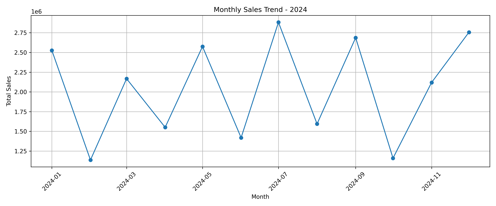
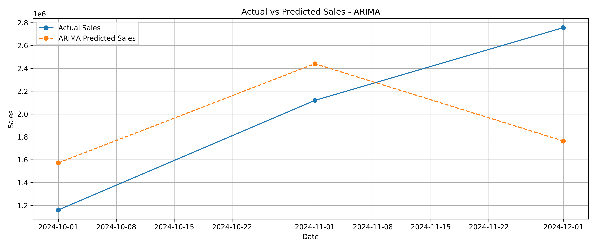
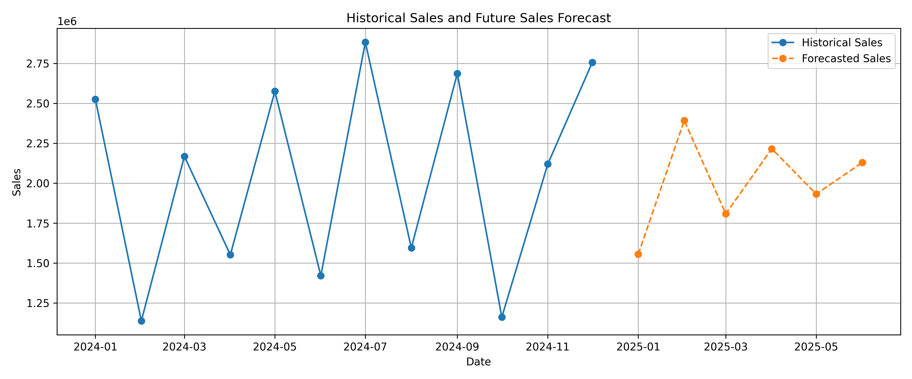

# Thiranex Task 3 – Predictive Analytics Using Historical Data

## Project Overview

This project focuses on predictive analytics using historical sales data.

The objective is to analyze historical sales trends, preprocess the dataset,
build predictive models, evaluate model performance, and forecast future sales.

## Dataset

The dataset contains sales records from January 2024 to December 2024.

### Important Columns

- Order_ID
- Order_Date
- Customer_ID
- Customer_Name
- City
- Region
- Product_ID
- Product
- Category
- Quantity
- Unit_Price
- Discount_%
- Sales
- Cost
- Profit
- Year
- Month
- Month_Number
- Quarter

## Technologies Used

- Python
- Google Colab
- Pandas
- NumPy
- Matplotlib
- Scikit-learn
- Statsmodels
- Excel

## Data Preprocessing

The dataset was checked for:

- Missing values
- Duplicate records
- Duplicate Order IDs
- Date formatting
- Data types

No missing values or duplicate records were found.

The `Order_Date` column was converted into the appropriate datetime format.

## Exploratory Data Analysis

Monthly sales were aggregated to identify historical sales trends.

A monthly sales trend visualization was created using Matplotlib.

## Predictive Modeling

The following approaches were explored:

1. Linear Regression
2. Random Forest Regression
3. ARIMA Time-Series Forecasting

ARIMA was selected as the final forecasting approach because it is
specifically designed for time-series forecasting.

## Model Evaluation

### Linear Regression

- MAE: ₹585,894.91
- RMSE: ₹719,562.62
- R² Score: -0.2033

### ARIMA

- MAE: ₹574,810.32
- RMSE: ₹647,125.05
- R² Score: 0.0268

ARIMA produced lower MAE and RMSE than the Linear Regression baseline
and achieved a positive R² score.

## Future Sales Forecast

The final ARIMA model was trained using all available monthly sales data
from 2024 and used to forecast sales for January 2025 to June 2025.

| Month | Forecasted Sales |
|---|---:|
| January 2025 | ₹15,54,306 |
| February 2025 | ₹23,92,061 |
| March 2025 | ₹18,08,026 |
| April 2025 | ₹22,15,182 |
| May 2025 | ₹19,31,336 |
| June 2025 | ₹21,29,217 |

## Key Findings

- Monthly sales showed significant variation throughout 2024.
- July recorded the highest monthly sales.
- February recorded the lowest monthly sales.
- ARIMA performed better than the Linear Regression baseline on the test period.
- The forecast indicates continued variation in monthly sales during the first half of 2025.

## Project Visualizations

### Monthly Sales Trend

### Actual vs Predicted Sales

### Future Sales Forecast

## Conclusion

This project demonstrates the application of predictive analytics to
historical sales data.

The workflow includes:

- Data preprocessing
- Exploratory data analysis
- Predictive modeling
- Model evaluation
- Data visualization
- Future sales forecasting

The results should be interpreted with caution because the dataset
contains only one year of historical monthly observations. More historical
data would help build a more reliable forecasting model.

## Project Files

- `Thiranex_Task3_Predictive_Analytics.ipynb` – Complete Google Colab notebook
- `PowerBI_Tutorial_Matching_Sales_Dataset.xlsx` – Dataset
- `future_sales_forecast.csv` – Future sales predictions
- `model_predictions.csv` – Actual vs predicted test results
- `monthly_sales_trend.png` – Monthly sales visualization
- `actual_vs_predicted_arima.png` – ARIMA evaluation visualization
- `future_sales_forecast.png` – Future forecast visualization
- `requirements.txt` – Required Python libraries
